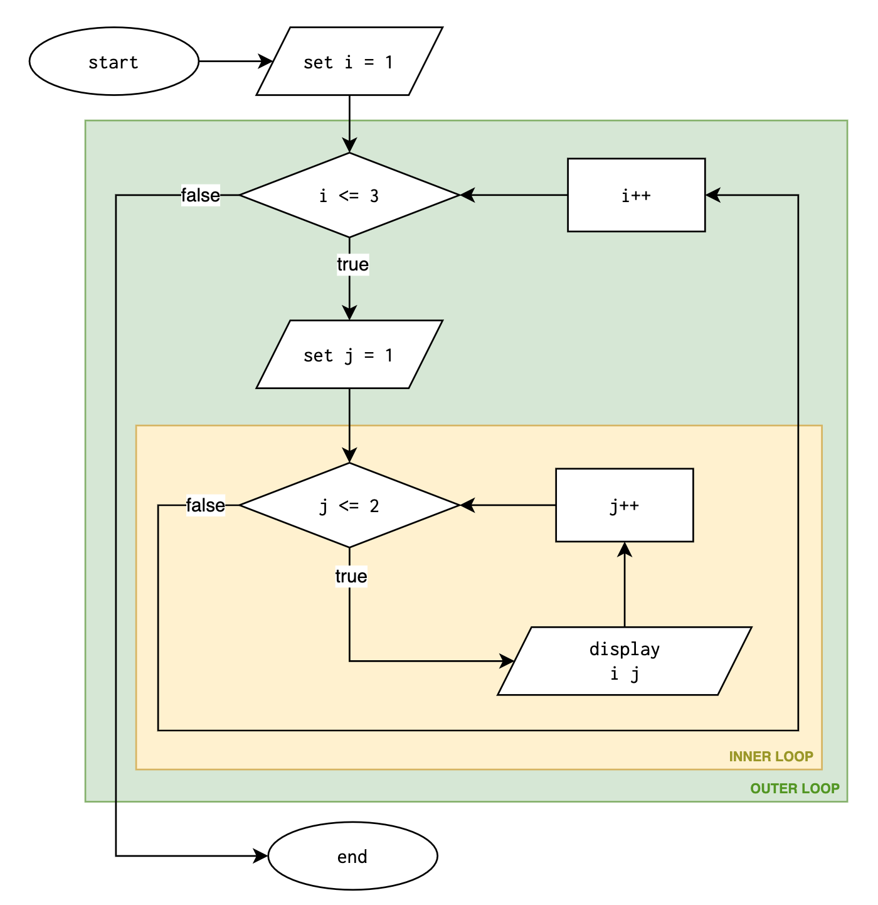
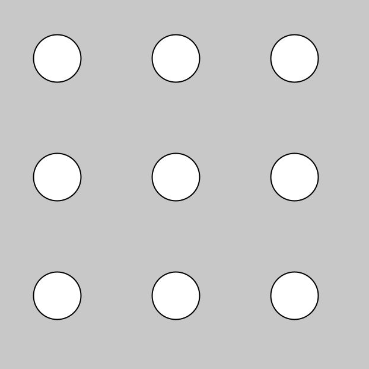

# Lesson: Nested Loops

So far, we have used loops to repeat a task in one direction: counting upward, counting downward, or repeating until a condition changes. However, many tasks in computing involve **repeated repetition**. That is, repeating something **inside** something else.

Examples:
- Printing rows and columns (tables, grids)
- Working with seating charts or game boards
- Drawing repeated shapes in Processing graphics
- Building multiplication tables
- Simulating combinations of values

To represent repetition *within* repetition, we use **nested loops**. A nested loop is simply a **loop inside another loop**.

<br>

## Basic Structure

```java
for (int outer = 0; outer < outerMax; outer++) {
    // something repeated outerMax times

    for (int inner = 0; inner < innerMax; inner++) {
        // something repeated innerMax times each time outer loop runs
    }
}
```

The outer loop controls the *rows* or overall cycles.  
The inner loop controls the *columns* or work done *within* each cycle.

A helpful way to visualize:
- The outer loop chooses which row you are on.
- The inner loop prints (or processes) the columns in that row.

<br>

## Example 1: Flowchart & Tracing Table

Determine the output of this code using flowcharts and tracing tables:

```java
for (int i = 1; i <= 3; i++) {
    for (int j = 1; j <= 2; j++) {
        System.out.println(i + " " + j);
    }
}
```

We can use a flowchart to visualize the nested loops. The inner loop (`j++`) is yellow, and the outer loop (`i++`) is green.



This produces the tracing table below:

| Step | `i` value | `j` value | Condition checked | Printed line | Action after print |
|:---:|:----------------------:|:-------------:|:------------------|:-------------|:-------------------|
| 1 | 1 | 1 | `i<=3` true, `j<=2` true | `1 1` | `j++` → `j=2` |
| 2 | 1 | 2 | `i<=3` true, `j<=2` true | `1 2` | `j++` → `j=3` |
| 3 | 1 | 3 | `j<=2` false → exit inner | — | `i++` → `i=2`, reset `j=1` |
| 4 | 2 | 1 | `i<=3` true, `j<=2` true | `2 1` | `j++` → `j=2` |
| 5 | 2 | 2 | `i<=3` true, `j<=2` true | `2 2` | `j++` → `j=3` |
| 6 | 2 | 3 | `j<=2` false → exit inner | — | `i++` → `i=3`, reset `j=1` |
| 7 | 3 | 1 | `i<=3` true, `j<=2` true | `3 1` | `j++` → `j=2` |
| 8 | 3 | 2 | `i<=3` true, `j<=2` true | `3 2` | `j++` → `j=3` |
| 9 | 3 | 3 | `j<=2` false → exit inner | — | `i++` → `i=4` |
| 10 | 4 | — | `i<=3` false → exit outer | — | end |

**Expected Output:**
```
1 1
1 2
2 1
2 2
3 1
3 2
```
<br>

## Example 2: Printing a Simple Grid

```java
for (int row = 1; row <= 3; row++) {
    for (int col = 1; col <= 3; col++) {
        System.out.print("(" + row + "," + col + ") ");
    }
    System.out.println(); // move to the next row
}
```

**Output:**
```
(1,1) (1,2) (1,3)
(2,1) (2,2) (2,3)
(3,1) (3,2) (3,3)
```

Notice:
- `System.out.print()` prints on the same line.
- `System.out.println()` moves to the next line **after** the inner loop completes.

<br>

## Example 3: Repeating Characters

```java
for (int row = 1; row <= 4; row++) {
    for (int col = 1; col <= 6; col++) {
        System.out.print("*");
    }
    System.out.println();
}
```

Here, 4 rows × 6 columns:

**Output:**
```
******
******
******
******
```

<br>

## Example 4: Multiplication Table

```java
for (int row = 1; row <= 5; row++) {
    for (int col = 1; col <= 5; col++) {
        System.out.print((row * col) + "	");
    }
    System.out.println();
}
```

Produces a 5×5 multiplication chart:

**Output:**
```
1       2       3       4       5
2       4       6       8       10
3       6       9       12      15
4       8       12      16      20
5       10      15      20      25
```

<br>

## Example 5: Processing Graphics

```java
for (int row = 0; row < 3; row++) {
    for (int col = 0; col < 3; col++) {
        ellipse(50 + col * 100, 50 + row * 100, 40, 40);
    }
}
```

This draws a 3×3 grid of circles:



Or, in keeping with our desire to write clearer code, we can refactor the above using meaningful variables (and fewer [magic numbers](https://en.wikipedia.org/wiki/Magic_number_(programming))) to communicate its intent:

```java
// Grid configuration
int rows = 3;
int cols = 3;

int circleSize = 40;        // diameter
int spacing = 100;          // distance between circles
int margin = 50;            // distance from top/left edge

for (int row = 0; row < rows; row++) {
    for (int col = 0; col < cols; col++) {
        float x = margin + col * spacing;
        float y = margin + row * spacing;
        ellipse(x, y, circleSize, circleSize);
    }
}
```

Code should communicate what we are doing, not just how we are doing it!

<br>

# Practice Problems — Nested Loops

### 1. Number Grid
Print the numbers 1 to 4 in a 4×4 grid. Remember, your solution should use nested loops!

HINT: Remember to use `print` vs `println` appropriately. 

```
1 2 3 4
1 2 3 4
1 2 3 4
1 2 3 4
```

<br>

### 2. Triangle of Stars (Left-Aligned)
Ask for the number of rows. Print a left-aligned triangle of `*` symbols, as in the example below.


```
How many rows? 5

*
**
***
****
*****
```

<br>


### 3. Rectangle of Characters
Ask for width and height. Print a rectangle of `#` symbols.

```
Width? 6
Height? 3

Here's your rectangle:

######
######
######
```

<br>

### 4. Row and Column Labels
Print coordinates `(row,col)` for a table with 3 rows and 5 columns. 

HINTS: Rows numbered 1 to 3, columns numbered 1 to 5. No need for user input.

```
(1,1) (1,2) (1,3) (1,4) (1,5)
(2,1) (2,2) (2,3) (2,4) (2,5)
(3,1) (3,2) (3,3) (3,4) (3,5)
``` 

<br>

### 5. Multiplication Table up to n
Ask the user for `n`. Print an `n × n` multiplication table. 

```
n? 4
1 2 3 4
2 4 6 8
3 6 9 12
4 8 12 16
```

BONUS: Make the columns line up neatly and draw a border to divide the header row and column.

```
n? 4

    1   2   3   4
  +---------------
1 | 1   2   3   4
2 | 2   4   6   8
3 | 3   6   9  12
4 | 4   8  12  16
```

<br>

### 6. Checkerboard of X and O
Print an alternating `X` and `O` pattern in a 5x5 grid:

```
XOXOX
OXOXO
XOXOX
OXOXO
XOXOX
```

BONUS: Make the size of the checkerboard determined by user input.

```
n? 6
XOXOXO
OXOXOX
XOXOXO
OXOXOX
XOXOXO
OXOXOX
```

<br>

### 7. Diagonal Line (Challenging)
Print `*` where `row == column`, spaces elsewhere.
Size is determined by user input.

```
n? 5
*    
  *  
    *
      *
        *
```

Another runtime example, user enters 3:

```
n? 3
*       
  *     
    *
``` 

<br>

### 8. Hollow Square (Challenging)
Only print `*` on the border, spaces inside.

HINT: Use conditionals inside the inner loop.

```
n? 4
****
*  *
*  *
****
```

<br>

### 9. Right-Aligned Number Triangle (Challenging)
Ask for the number of rows. Print a right-aligned triangle of numbers.

```
n = 5
        1
      1 2
    1 2 3
  1 2 3 4
1 2 3 4 5
```

<br>

### 10. Custom Pattern (Creative Challenge)
Create your own unique pattern of text characters using nested loops. It could be a shape, a design, or a combination of characters. Be creative!